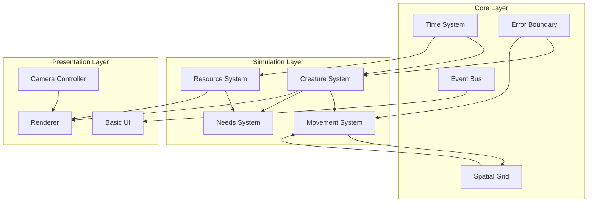

# Phase 1: MVP Architecture

## Overview

Phase 1 implements the minimal viable creature simulation with 500 creatures at 60 FPS. Focus is on core systems working correctly with simple, extensible architecture.

## System Architecture Diagram



## Core Data Models

### Entity Model

```rust
// Simple entity type for Phase 1
#[derive(Debug, Clone, Copy, PartialEq, Eq, Hash)]
pub struct Entity(u32);

impl Entity {
    pub fn new(id: u32) -> Self {
        Entity(id)
    }
}

// Entity manager
pub struct EntityManager {
    next_id: u32,
    active_entities: HashSet<Entity>,
    recycled_ids: Vec<u32>,
}

impl EntityManager {
    pub fn create(&mut self) -> Entity {
        let id = self.recycled_ids.pop().unwrap_or_else(|| {
            let id = self.next_id;
            self.next_id += 1;
            id
        });
        
        let entity = Entity(id);
        self.active_entities.insert(entity);
        entity
    }
    
    pub fn destroy(&mut self, entity: Entity) {
        if self.active_entities.remove(&entity) {
            self.recycled_ids.push(entity.0);
        }
    }
}
```

### Creature Model

```rust
// Core creature data - kept simple for Phase 1
#[derive(Debug, Clone)]
pub struct Creature {
    pub id: Entity,
    pub position: Vec2,
    pub velocity: Vec2,
    pub health: Health,
    pub needs: Needs,
    pub state: CreatureState,
    pub age: f32,
    pub size: f32,
}

#[derive(Debug, Clone)]
pub struct Health {
    pub current: f32,
    pub max: f32,
}

#[derive(Debug, Clone)]
pub struct Needs {
    pub hunger: f32,    // 0.0 = full, 1.0 = starving
    pub thirst: f32,    // 0.0 = hydrated, 1.0 = dehydrated
    pub energy: f32,    // 0.0 = exhausted, 1.0 = full energy
}

#[derive(Debug, Clone, Copy, PartialEq)]
pub enum CreatureState {
    Idle,
    Moving { target: Vec2 },
    Eating,
    Drinking,
    Resting,
    Dead,
}
```

### Resource Model

```rust
#[derive(Debug, Clone)]
pub struct Resource {
    pub id: Entity,
    pub position: Vec2,
    pub resource_type: ResourceType,
    pub amount: f32,
    pub max_amount: f32,
}

#[derive(Debug, Clone, Copy, PartialEq)]
pub enum ResourceType {
    Food,
    Water,
}

impl ResourceType {
    pub fn regeneration_rate(&self) -> f32 {
        match self {
            ResourceType::Food => 0.1,  // per second
            ResourceType::Water => 1.0,  // per second
        }
    }
    
    pub fn consumption_rate(&self) -> f32 {
        match self {
            ResourceType::Food => 0.05,  // per second while eating
            ResourceType::Water => 0.1,   // per second while drinking
        }
    }
}
```

## Core System Interfaces

### System Trait

```rust
pub trait System {
    fn update(&mut self, world: &mut World, dt: f32);
    fn name(&self) -> &'static str;
}

pub struct World {
    pub entities: EntityManager,
    pub creatures: HashMap<Entity, Creature>,
    pub resources: HashMap<Entity, Resource>,
    pub spatial_grid: SpatialGrid,
    pub events: EventBus,
    pub time: GameTime,
    pub error_boundary: ErrorBoundary,
}
```

### Time System

```rust
pub struct TimeSystem {
    accumulated_time: f64,
    game_time: f64,
    time_scale: f32,
    paused: bool,
}

impl TimeSystem {
    pub fn update(&mut self, real_dt: f32) -> f32 {
        if self.paused {
            return 0.0;
        }
        
        let scaled_dt = real_dt * self.time_scale;
        self.accumulated_time += scaled_dt as f64;
        self.game_time += scaled_dt as f64;
        
        scaled_dt
    }
    
    pub fn set_time_scale(&mut self, scale: f32) {
        self.time_scale = scale.clamp(0.0, 10.0); // Phase 1: Max 10x
    }
}

pub struct GameTime {
    pub total_seconds: f64,
    pub delta_seconds: f32,
    pub frame_count: u64,
}
```

### Spatial Grid System

```rust
pub struct SpatialGrid {
    cell_size: f32,
    cells: HashMap<GridCoord, Vec<Entity>>,
    entity_positions: HashMap<Entity, GridCoord>,
}

#[derive(Debug, Clone, Copy, Hash, PartialEq, Eq)]
pub struct GridCoord {
    pub x: i32,
    pub y: i32,
}

impl SpatialGrid {
    pub fn new(cell_size: f32) -> Self {
        Self {
            cell_size,
            cells: HashMap::new(),
            entity_positions: HashMap::new(),
        }
    }
    
    pub fn insert(&mut self, entity: Entity, position: Vec2) {
        let coord = self.world_to_grid(position);
        
        // Remove from old cell if exists
        if let Some(old_coord) = self.entity_positions.get(&entity) {
            if let Some(entities) = self.cells.get_mut(old_coord) {
                entities.retain(|&e| e != entity);
            }
        }
        
        // Add to new cell
        self.cells.entry(coord).or_default().push(entity);
        self.entity_positions.insert(entity, coord);
    }
    
    pub fn query_radius(&self, center: Vec2, radius: f32) -> Vec<Entity> {
        let mut results = Vec::new();
        
        let min_coord = self.world_to_grid(center - Vec2::splat(radius));
        let max_coord = self.world_to_grid(center + Vec2::splat(radius));
        
        for x in min_coord.x..=max_coord.x {
            for y in min_coord.y..=max_coord.y {
                if let Some(entities) = self.cells.get(&GridCoord { x, y }) {
                    results.extend_from_slice(entities);
                }
            }
        }
        
        results
    }
    
    fn world_to_grid(&self, pos: Vec2) -> GridCoord {
        GridCoord {
            x: (pos.x / self.cell_size).floor() as i32,
            y: (pos.y / self.cell_size).floor() as i32,
        }
    }
}
```

### Event System

```rust
pub struct EventBus {
    events: VecDeque<GameEvent>,
    handlers: HashMap<TypeId, Vec<Box<dyn EventHandler>>>,
}

pub trait EventHandler: Send {
    fn handle(&mut self, event: &GameEvent, world: &mut World);
}

#[derive(Debug, Clone)]
pub enum GameEvent {
    CreatureSpawned { entity: Entity, position: Vec2 },
    CreatureDied { entity: Entity, cause: DeathCause },
    ResourceDepleted { entity: Entity },
    ResourceReplenished { entity: Entity },
    CreatureStateChanged { entity: Entity, old: CreatureState, new: CreatureState },
}

#[derive(Debug, Clone)]
pub enum DeathCause {
    Starvation,
    Dehydration,
    OldAge,
}

impl EventBus {
    pub fn emit(&mut self, event: GameEvent) {
        self.events.push_back(event);
    }
    
    pub fn process(&mut self, world: &mut World) {
        while let Some(event) = self.events.pop_front() {
            let type_id = TypeId::of::<GameEvent>();
            
            if let Some(handlers) = self.handlers.get_mut(&type_id) {
                for handler in handlers {
                    handler.handle(&event, world);
                }
            }
        }
    }
}
```

## Simulation Systems

### Movement System

```rust
pub struct MovementSystem {
    pathfinding_requests: Vec<PathRequest>,
}

pub struct PathRequest {
    entity: Entity,
    target: Vec2,
    priority: f32,
}

impl System for MovementSystem {
    fn update(&mut self, world: &mut World, dt: f32) {
        // Process movement for all creatures
        let creatures_to_update: Vec<Entity> = world.creatures.keys().copied().collect();
        
        for entity in creatures_to_update {
            if let Some(creature) = world.creatures.get_mut(&entity) {
                match creature.state {
                    CreatureState::Moving { target } => {
                        self.update_movement(creature, target, dt, world);
                    }
                    _ => {
                        // Stop movement
                        creature.velocity = Vec2::ZERO;
                    }
                }
            }
        }
    }
    
    fn name(&self) -> &'static str {
        "Movement"
    }
}

impl MovementSystem {
    fn update_movement(&self, creature: &mut Creature, target: Vec2, dt: f32, world: &World) {
        let to_target = target - creature.position;
        let distance = to_target.length();
        
        if distance < 1.0 {
            // Reached target
            creature.velocity = Vec2::ZERO;
            creature.state = CreatureState::Idle;
        } else {
            // Simple movement towards target
            let direction = to_target.normalize();
            let speed = 10.0; // Base speed
            
            creature.velocity = direction * speed;
            creature.position += creature.velocity * dt;
            
            // Update spatial grid
            world.spatial_grid.insert(creature.id, creature.position);
        }
    }
}
```

### Needs System

```rust
pub struct NeedsSystem {
    metabolism_rate: f32,
    thirst_rate: f32,
    rest_recovery_rate: f32,
}

impl System for NeedsSystem {
    fn update(&mut self, world: &mut World, dt: f32) {
        let mut state_changes = Vec::new();
        
        for (entity, creature) in world.creatures.iter_mut() {
            // Update needs based on current state
            match creature.state {
                CreatureState::Idle | CreatureState::Moving { .. } => {
                    creature.needs.hunger += self.metabolism_rate * dt;
                    creature.needs.thirst += self.thirst_rate * dt;
                    creature.needs.energy -= 0.01 * dt;
                }
                CreatureState::Eating => {
                    creature.needs.hunger -= 0.2 * dt;
                    creature.needs.energy -= 0.005 * dt;
                }
                CreatureState::Drinking => {
                    creature.needs.thirst -= 0.3 * dt;
                }
                CreatureState::Resting => {
                    creature.needs.energy += self.rest_recovery_rate * dt;
                    creature.needs.hunger += self.metabolism_rate * 0.5 * dt;
                    creature.needs.thirst += self.thirst_rate * 0.5 * dt;
                }
                CreatureState::Dead => continue,
            }
            
            // Clamp needs
            creature.needs.hunger = creature.needs.hunger.clamp(0.0, 1.0);
            creature.needs.thirst = creature.needs.thirst.clamp(0.0, 1.0);
            creature.needs.energy = creature.needs.energy.clamp(0.0, 1.0);
            
            // Check for critical needs
            if creature.needs.hunger >= 1.0 || creature.needs.thirst >= 1.0 {
                creature.health.current -= 10.0 * dt;
                
                if creature.health.current <= 0.0 {
                    state_changes.push((*entity, CreatureState::Dead));
                    world.events.emit(GameEvent::CreatureDied {
                        entity: *entity,
                        cause: if creature.needs.hunger >= 1.0 { 
                            DeathCause::Starvation 
                        } else { 
                            DeathCause::Dehydration 
                        },
                    });
                }
            }
        }
        
        // Apply state changes
        for (entity, new_state) in state_changes {
            if let Some(creature) = world.creatures.get_mut(&entity) {
                creature.state = new_state;
            }
        }
    }
    
    fn name(&self) -> &'static str {
        "Needs"
    }
}
```

### Decision System

```rust
pub struct DecisionSystem {
    decision_interval: f32,
    time_since_last_decision: f32,
}

impl System for DecisionSystem {
    fn update(&mut self, world: &mut World, dt: f32) {
        self.time_since_last_decision += dt;
        
        if self.time_since_last_decision < self.decision_interval {
            return;
        }
        
        self.time_since_last_decision = 0.0;
        
        let creatures_to_update: Vec<Entity> = world.creatures.keys().copied().collect();
        
        for entity in creatures_to_update {
            if let Some(creature) = world.creatures.get(&entity).cloned() {
                if creature.state == CreatureState::Dead {
                    continue;
                }
                
                let decision = self.make_decision(&creature, world);
                
                if let Some(creature_mut) = world.creatures.get_mut(&entity) {
                    self.apply_decision(creature_mut, decision, world);
                }
            }
        }
    }
    
    fn name(&self) -> &'static str {
        "Decision"
    }
}

impl DecisionSystem {
    fn make_decision(&self, creature: &Creature, world: &World) -> Decision {
        // Priority-based decision making
        if creature.needs.energy < 0.2 {
            return Decision::Rest;
        }
        
        if creature.needs.thirst > 0.6 {
            if let Some(water) = self.find_nearest_resource(creature, ResourceType::Water, world) {
                return Decision::GoTo { target: water, reason: GoToReason::Drink };
            }
        }
        
        if creature.needs.hunger > 0.5 {
            if let Some(food) = self.find_nearest_resource(creature, ResourceType::Food, world) {
                return Decision::GoTo { target: food, reason: GoToReason::Eat };
            }
        }
        
        // Default: wander
        Decision::Wander
    }
    
    fn find_nearest_resource(&self, creature: &Creature, resource_type: ResourceType, world: &World) -> Option<Vec2> {
        let nearby_entities = world.spatial_grid.query_radius(creature.position, 50.0);
        
        let mut nearest: Option<(Vec2, f32)> = None;
        
        for entity in nearby_entities {
            if let Some(resource) = world.resources.get(&entity) {
                if resource.resource_type == resource_type && resource.amount > 0.0 {
                    let distance = (resource.position - creature.position).length();
                    
                    if nearest.is_none() || distance < nearest.unwrap().1 {
                        nearest = Some((resource.position, distance));
                    }
                }
            }
        }
        
        nearest.map(|(pos, _)| pos)
    }
    
    fn apply_decision(&self, creature: &mut Creature, decision: Decision, world: &World) {
        match decision {
            Decision::GoTo { target, reason } => {
                creature.state = CreatureState::Moving { target };
            }
            Decision::Rest => {
                creature.state = CreatureState::Resting;
            }
            Decision::Wander => {
                let angle = rand::random::<f32>() * std::f32::consts::TAU;
                let distance = 20.0;
                let target = creature.position + Vec2::new(angle.cos(), angle.sin()) * distance;
                creature.state = CreatureState::Moving { target };
            }
        }
    }
}

#[derive(Debug)]
enum Decision {
    GoTo { target: Vec2, reason: GoToReason },
    Rest,
    Wander,
}

#[derive(Debug)]
enum GoToReason {
    Eat,
    Drink,
}
```

## Resource Management System

```rust
pub struct ResourceSystem {
    regeneration_timer: f32,
    regeneration_interval: f32,
}

impl System for ResourceSystem {
    fn update(&mut self, world: &mut World, dt: f32) {
        self.regeneration_timer += dt;
        
        let mut depleted_resources = Vec::new();
        
        // Update resources
        for (entity, resource) in world.resources.iter_mut() {
            // Check for consumption
            let nearby_creatures = world.spatial_grid.query_radius(resource.position, 2.0);
            
            for creature_entity in nearby_creatures {
                if let Some(creature) = world.creatures.get(&creature_entity) {
                    match (creature.state, resource.resource_type) {
                        (CreatureState::Eating, ResourceType::Food) |
                        (CreatureState::Drinking, ResourceType::Water) => {
                            let consumption = resource.resource_type.consumption_rate() * dt;
                            resource.amount -= consumption;
                            
                            if resource.amount <= 0.0 {
                                resource.amount = 0.0;
                                depleted_resources.push(*entity);
                            }
                        }
                        _ => {}
                    }
                }
            }
        }
        
        // Regenerate resources
        if self.regeneration_timer >= self.regeneration_interval {
            self.regeneration_timer = 0.0;
            
            for (_, resource) in world.resources.iter_mut() {
                if resource.amount < resource.max_amount {
                    let regen = resource.resource_type.regeneration_rate() * self.regeneration_interval;
                    resource.amount = (resource.amount + regen).min(resource.max_amount);
                }
            }
        }
        
        // Emit depletion events
        for entity in depleted_resources {
            world.events.emit(GameEvent::ResourceDepleted { entity });
        }
    }
    
    fn name(&self) -> &'static str {
        "Resource"
    }
}
```

## Rendering and UI

### Camera Controller

```rust
pub struct CameraController {
    pub position: Vec2,
    pub zoom: f32,
    pub viewport_size: Vec2,
    pub movement_speed: f32,
    pub zoom_speed: f32,
}

impl CameraController {
    pub fn update(&mut self, input: &InputState, dt: f32) {
        // WASD movement
        let mut movement = Vec2::ZERO;
        
        if input.is_key_pressed(KeyCode::W) { movement.y += 1.0; }
        if input.is_key_pressed(KeyCode::S) { movement.y -= 1.0; }
        if input.is_key_pressed(KeyCode::A) { movement.x -= 1.0; }
        if input.is_key_pressed(KeyCode::D) { movement.x += 1.0; }
        
        if movement.length() > 0.0 {
            movement = movement.normalize();
            self.position += movement * self.movement_speed * dt / self.zoom;
        }
        
        // Scroll zoom
        if input.scroll_delta != 0.0 {
            self.zoom *= 1.0 + input.scroll_delta * self.zoom_speed;
            self.zoom = self.zoom.clamp(0.5, 5.0);
        }
    }
    
    pub fn world_to_screen(&self, world_pos: Vec2) -> Vec2 {
        (world_pos - self.position) * self.zoom + self.viewport_size * 0.5
    }
    
    pub fn screen_to_world(&self, screen_pos: Vec2) -> Vec2 {
        (screen_pos - self.viewport_size * 0.5) / self.zoom + self.position
    }
}
```

### Basic UI

```rust
pub struct UISystem {
    selected_creature: Option<Entity>,
    show_stats: bool,
    time_controls_pos: Vec2,
    stats_panel_pos: Vec2,
}

impl UISystem {
    pub fn update(&mut self, world: &World, input: &InputState, camera: &CameraController) {
        // Handle creature selection
        if input.mouse_clicked {
            let world_pos = camera.screen_to_world(input.mouse_position);
            self.selected_creature = self.find_creature_at(world_pos, world);
        }
        
        // Toggle stats with Tab
        if input.key_just_pressed(KeyCode::Tab) {
            self.show_stats = !self.show_stats;
        }
    }
    
    pub fn render(&self, world: &World, time_system: &TimeSystem) -> UIRenderData {
        let mut elements = Vec::new();
        
        // Time controls
        elements.push(UIElement::Panel {
            position: self.time_controls_pos,
            size: Vec2::new(200.0, 60.0),
            children: vec![
                UIElement::Text {
                    text: format!("Time: {:.1}x", time_system.time_scale),
                    position: Vec2::new(10.0, 10.0),
                },
                UIElement::Button {
                    text: if time_system.paused { "Resume" } else { "Pause" },
                    position: Vec2::new(10.0, 30.0),
                    size: Vec2::new(80.0, 20.0),
                    action: UIAction::TogglePause,
                },
            ],
        });
        
        // Selected creature info
        if let Some(entity) = self.selected_creature {
            if let Some(creature) = world.creatures.get(&entity) {
                elements.push(self.render_creature_panel(creature));
            }
        }
        
        // Stats overlay
        if self.show_stats {
            elements.push(self.render_stats_panel(world));
        }
        
        UIRenderData { elements }
    }
    
    fn find_creature_at(&self, pos: Vec2, world: &World) -> Option<Entity> {
        let nearby = world.spatial_grid.query_radius(pos, 5.0);
        
        for entity in nearby {
            if let Some(creature) = world.creatures.get(&entity) {
                let distance = (creature.position - pos).length();
                if distance < creature.size {
                    return Some(entity);
                }
            }
        }
        
        None
    }
}
```

## Main Game Loop

```rust
pub struct Game {
    world: World,
    systems: Vec<Box<dyn System>>,
    time_system: TimeSystem,
    camera: CameraController,
    ui: UISystem,
    renderer: Renderer,
    profiler: ProfilerSystem,
}

impl Game {
    pub fn new() -> Self {
        let mut world = World::new();
        
        // Initialize systems
        let systems: Vec<Box<dyn System>> = vec![
            Box::new(DecisionSystem::new()),
            Box::new(MovementSystem::new()),
            Box::new(NeedsSystem::new()),
            Box::new(ResourceSystem::new()),
        ];
        
        // Spawn initial creatures
        for i in 0..100 {
            let position = Vec2::new(
                rand::random::<f32>() * 1000.0,
                rand::random::<f32>() * 1000.0,
            );
            spawn_creature(&mut world, position);
        }
        
        // Spawn resources
        for i in 0..50 {
            let position = Vec2::new(
                rand::random::<f32>() * 1000.0,
                rand::random::<f32>() * 1000.0,
            );
            spawn_resource(&mut world, position, ResourceType::Food);
        }
        
        Self {
            world,
            systems,
            time_system: TimeSystem::new(),
            camera: CameraController::new(),
            ui: UISystem::new(),
            renderer: Renderer::new(),
            profiler: ProfilerSystem::new(),
        }
    }
    
    pub fn update(&mut self, real_dt: f32, input: &InputState) {
        self.profiler.begin_frame();
        
        // Update time
        let dt = self.time_system.update(real_dt);
        self.world.time.delta_seconds = dt;
        
        // Update camera
        self.camera.update(input, real_dt);
        
        // Update UI
        self.ui.update(&self.world, input, &self.camera);
        
        // Update systems
        for system in &mut self.systems {
            profile_scope!(self.profiler, system.name());
            system.update(&mut self.world, dt);
        }
        
        // Process events
        self.world.events.process(&mut self.world);
        
        // Check errors
        self.world.error_boundary.check_and_recover(&mut self.world);
        
        self.profiler.end_frame();
    }
    
    pub fn render(&mut self) {
        self.renderer.begin_frame();
        
        // Render world
        self.renderer.render_terrain(&self.world);
        self.renderer.render_resources(&self.world.resources);
        self.renderer.render_creatures(&self.world.creatures);
        
        // Render UI
        let ui_data = self.ui.render(&self.world, &self.time_system);
        self.renderer.render_ui(ui_data);
        
        // Render debug info
        if self.profiler.show_overlay {
            self.renderer.render_profiler_overlay(self.profiler.get_metrics());
        }
        
        self.renderer.end_frame();
    }
}

fn spawn_creature(world: &mut World, position: Vec2) -> Entity {
    let entity = world.entities.create();
    
    let creature = Creature {
        id: entity,
        position,
        velocity: Vec2::ZERO,
        health: Health { current: 100.0, max: 100.0 },
        needs: Needs { hunger: 0.3, thirst: 0.3, energy: 0.8 },
        state: CreatureState::Idle,
        age: 0.0,
        size: 1.0,
    };
    
    world.creatures.insert(entity, creature);
    world.spatial_grid.insert(entity, position);
    world.events.emit(GameEvent::CreatureSpawned { entity, position });
    
    entity
}

fn spawn_resource(world: &mut World, position: Vec2, resource_type: ResourceType) -> Entity {
    let entity = world.entities.create();
    
    let resource = Resource {
        id: entity,
        position,
        resource_type,
        amount: 100.0,
        max_amount: 100.0,
    };
    
    world.resources.insert(entity, resource);
    world.spatial_grid.insert(entity, position);
    
    entity
}
```

## Phase 1 Milestones

1. **Week 1-2**: Core systems (Entity, Time, Spatial, Events)
2. **Week 3-4**: Basic creatures with movement and needs
3. **Week 5-6**: Resources and simple decision making
4. **Week 7-8**: Camera, rendering, and basic UI
5. **Week 9-10**: Error handling, profiling, and polish
6. **Week 11-12**: Testing and performance optimization

This Phase 1 architecture provides a solid foundation that can be extended in later phases while keeping the initial scope manageable.