# Phase 1 Class Diagrams

## Core System Class Diagram

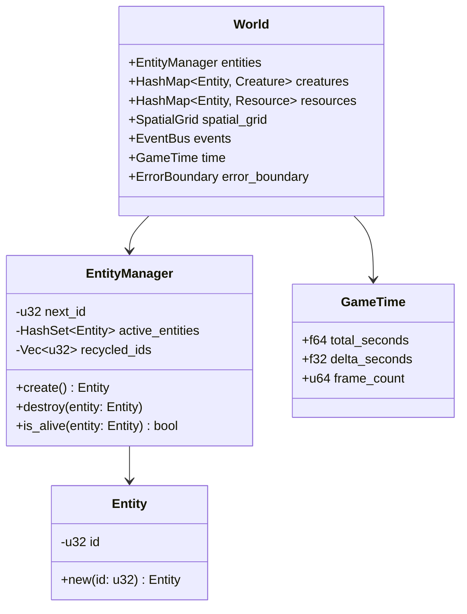

## Creature System Class Diagram

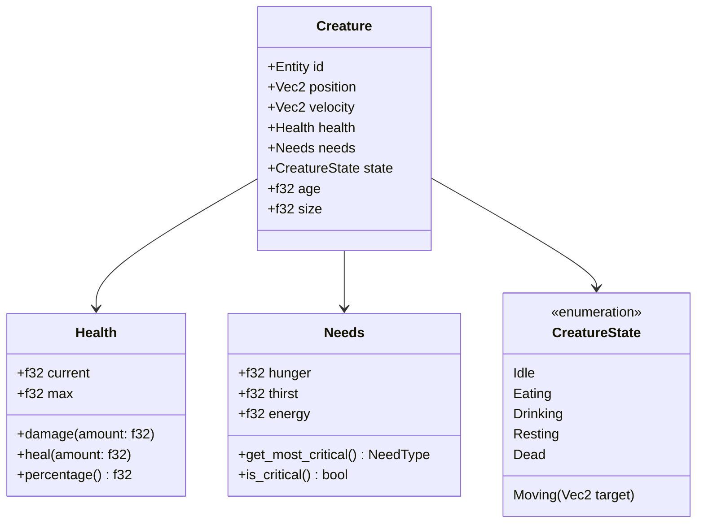

## Resource System Class Diagram

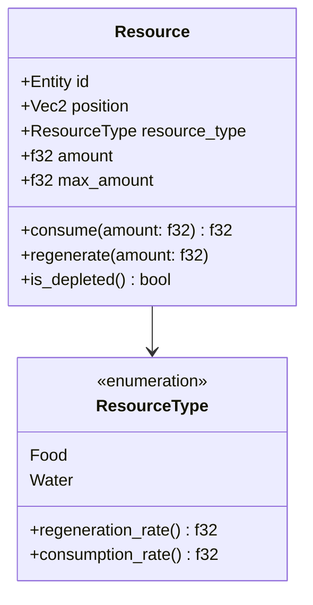

## System Architecture Class Diagram

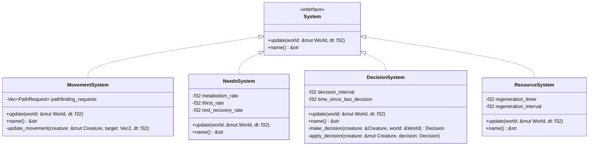

## Spatial System Class Diagram

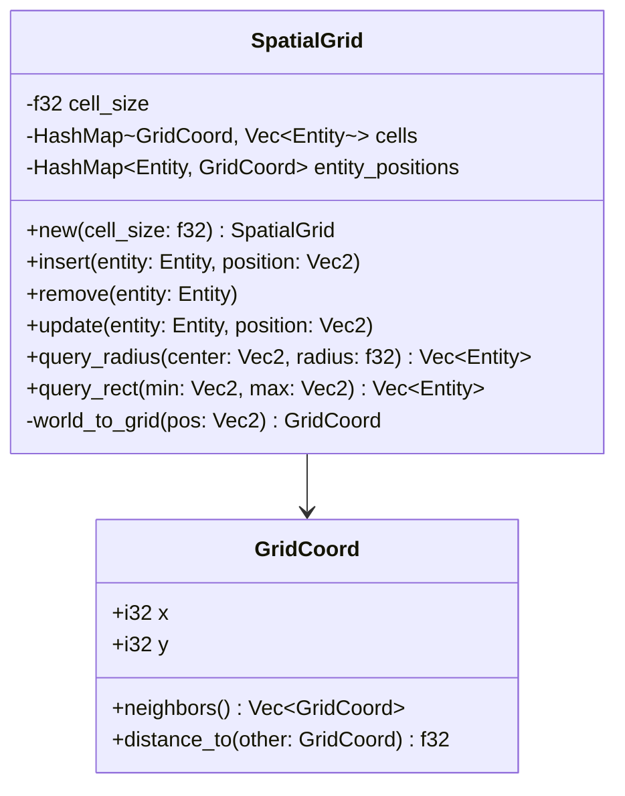

## Event System Class Diagram

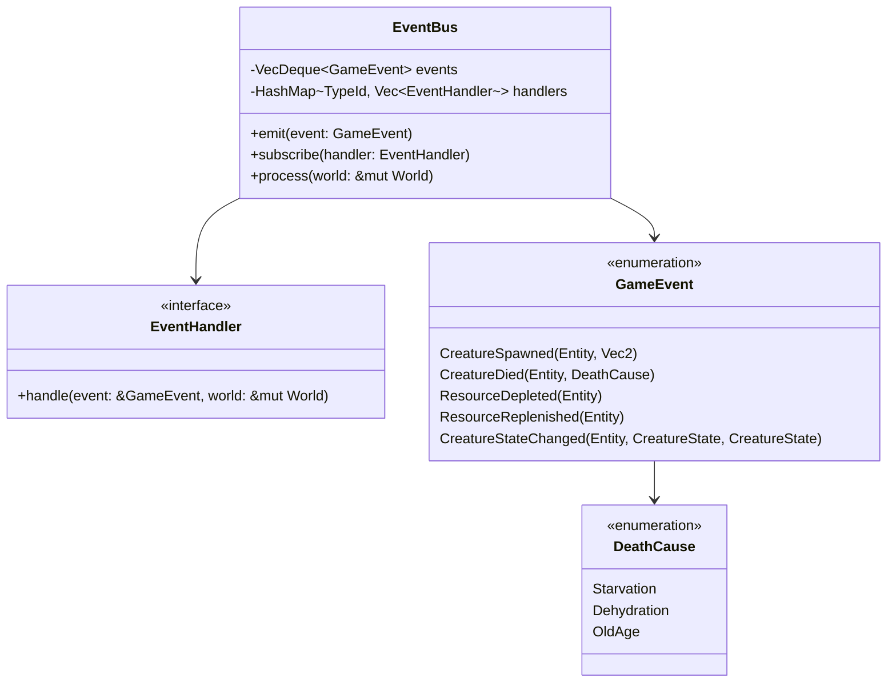

## Error System Class Diagram

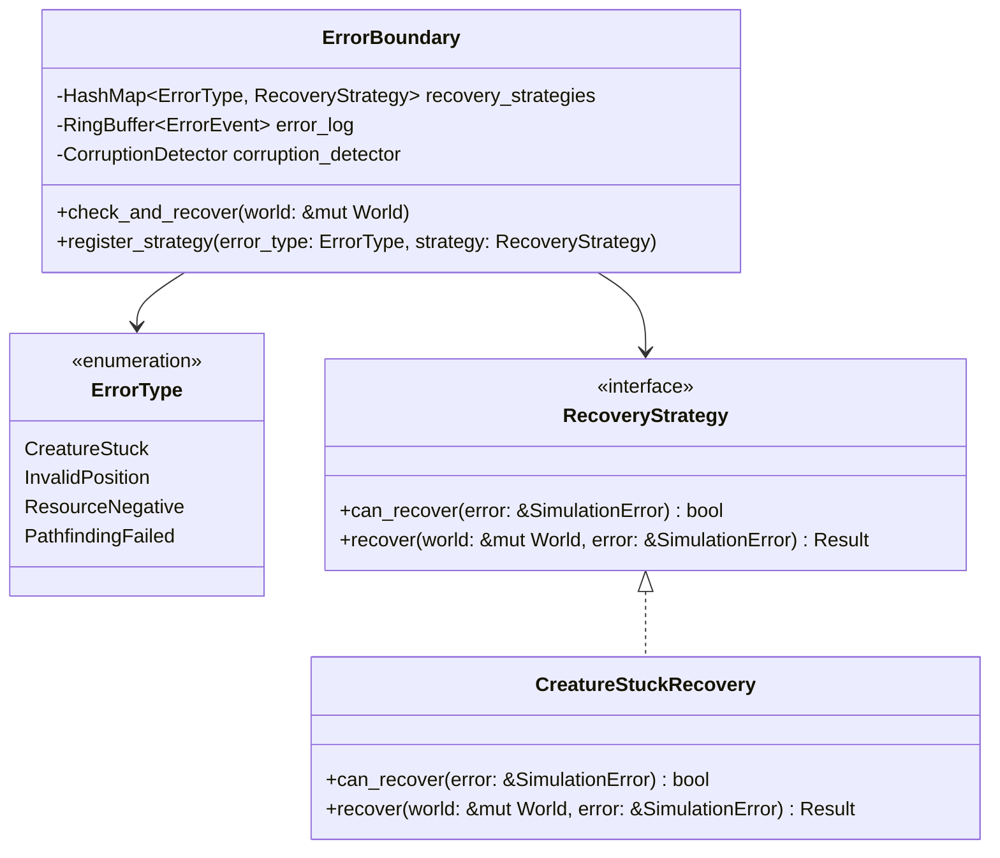

## UI System Class Diagram

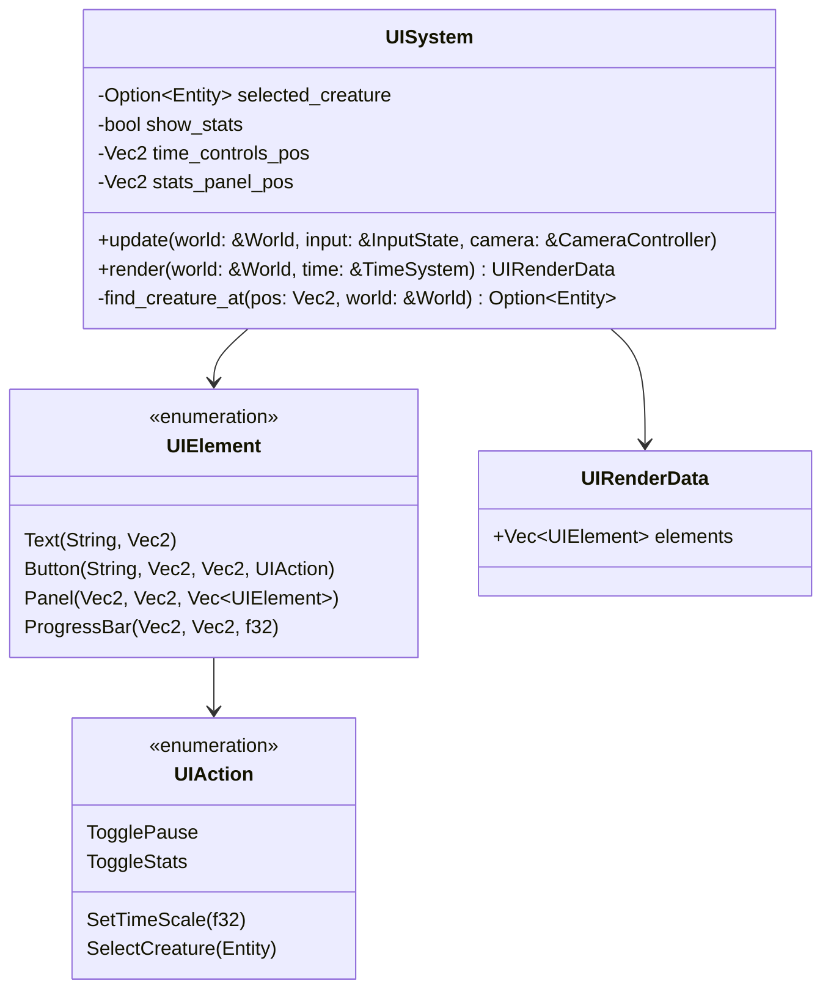

## Camera System Class Diagram

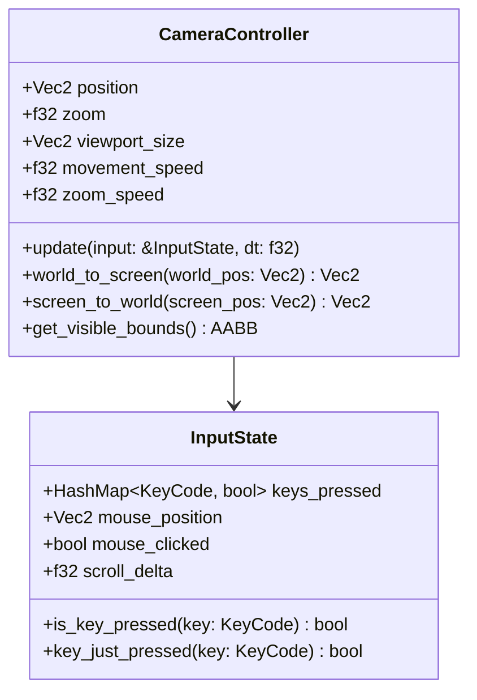

## Main Game Loop Class Diagram

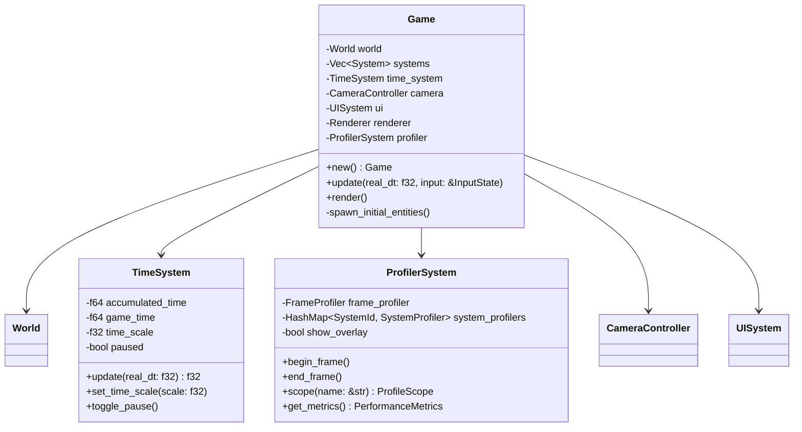

## Sequence Diagram: Creature Decision and Movement

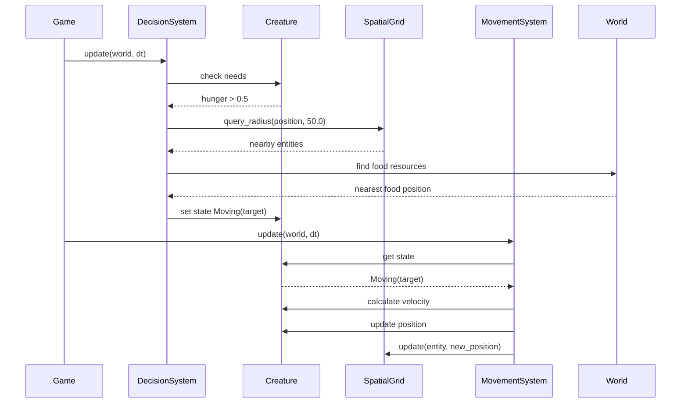

These diagrams provide a clear visual representation of the Phase 1 architecture, showing the relationships between classes and the flow of data through the system.